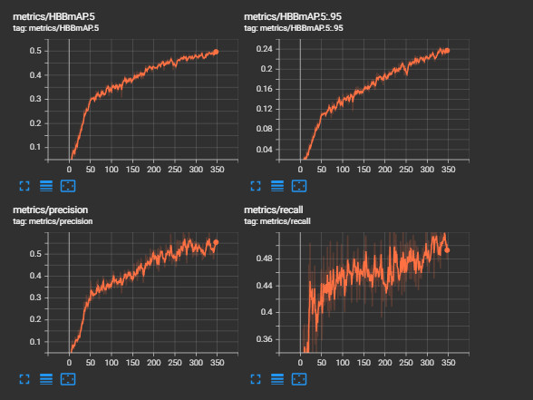
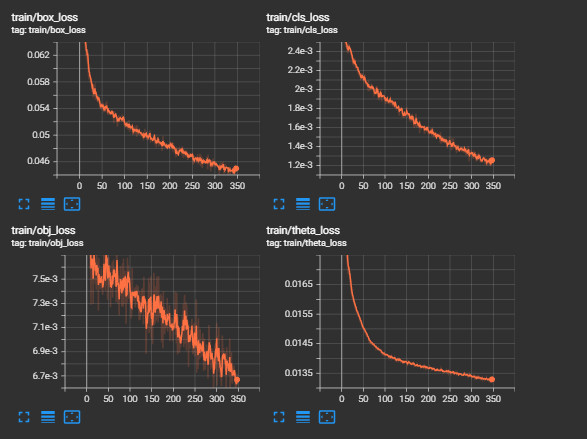
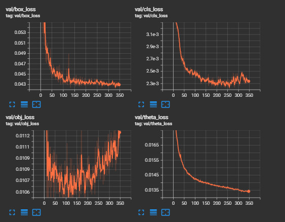

# Detecting the Multiple States of Oyster Activity and Orientation using Deep Learning Image Processing and Computer Vision Algorithms

## This research project was done at Salisbury University as part of the NSF REU Summer 2022 Program:
- [Salisbury University Website](https://www.salisbury.edu/)
- [NSF REU Salisbury Homepage](http://faculty.salisbury.edu/~ealu/REU/Schedule.html)

## Faculty Mentors:
### - Dr. Yuanwei Jin
### - Dr. Enyue (Annie) Lu

## Project Title:
*Image Processing and Computer Vision Algorithms for Sustainable Shellfish Farming*

## Research Participants:
### - Joshua Comfort
### - Ian Rudy

# References & Acknowledgements: 
- [Detectron2](https://github.com/facebookresearch/detectron2)
- [YOLOv5](https://github.com/ultralytics/yolov5)
- [YOLOv5_OBB](https://github.com/hukaixuan19970627/yolov5_obb)
- [Arbitrary-Oriented Object Detection](https://arxiv.org/abs/2003.05597v2)
- [Arbitrary-Oriented Object Detection Transformer](https://arxiv.org/abs/2205.12785)
- [Detecting and Counting Oysters](https://arxiv.org/abs/2105.09758)
- [Fish Recognition Dataset](https://homepages.inf.ed.ac.uk/rbf/Fish4Knowledge/GROUNDTRUTH/RECOG/)
- [Turning any CNN image classifier into an object detector](https://pyimagesearch.com/2020/06/22/turning-any-cnn-image-classifier-into-an-object-detector-with-keras-tensorflow-and-opencv/)
- [Underwater image processing](https://www.sciencedirect.com/science/article/pii/S0923596520302137)
- [Oyster detection system](https://github.com/bsadr/oyster-detection)
- [In Chesapeake Oysters’ Future: Underwater Drones, Shellfish Barges?](https://southernmarylandchronicle.com/2021/04/20/in-chesapeake-oysters-future-underwater-drones-shellfish-barges/)
- [PyTorch - YOLOv5](https://pytorch.org/hub/ultralytics_yolov5/)
- [DenseDepth](https://github.com/ialhashim/DenseDepth)

## Methods:

### - Dataset
The oyster detection dataset can be found under the dataset directory, it was compiled using 200 initially provided images and 800 images collected from various internet sources. All of the annotation was done using the online annotation tool [Roboflow](https://roboflow.com/). 

The dataset contains images spanning various environments and camera angles to help increase the model's ability to generalize the features that make up an oyster. The oysters contained in the images are classified into one of three states oyster-closed, oyster-semi-open, and oyster-fully-open. Improvements to the dataset that would help improve model perfromance include a greater number of images, image processing to clean up the images, and a consistent metric to help label oyster states accurately (This project used metrics proposed in a project done by researchers at UMES).

The dataset was exported from Roboflow using the Oriented Bounding Box format, however, the exportation from roboflow had some issues and the exported txt files contained negative coordinate values. To remove the negative values from the dataset, a shell script was written and can be found under the tools directory. A guide on how to properly format your own dataset using roboflow and the script can be found under the getting started guide.

### - Training
The training for this research was done using [Google Colab](https://colab.research.google.com/), Colab provides remote access to high-performance computing on GPU instances. By leveraging Google's services we trained these models under various numbers of epochs, dataset iterations, and backbones. The achieved results are shown below in the section *Results*. 

### - Evaluation
The models were evaluated using these common metrics [precision](https://developers.google.com/machine-learning/crash-course/classification/precision-and-recall), [recall](https://developers.google.com/machine-learning/crash-course/classification/precision-and-recall), [average precision (AP)](https://link.springer.com/referenceworkentry/10.1007/978-0-387-39940-9_482), and [mean average precision (mAP)](https://www.v7labs.com/blog/mean-average-precision#:~:text=Average%20Precision%20is%20calculated%20as,mAP%20varies%20in%20different%20contexts.)

##### Mean Average Precision


In addition to these metrics, the training and validation are evaluated using a [loss function](https://machinelearningmastery.com/loss-and-loss-functions-for-training-deep-learning-neural-networks/). A loss function helps show how far the model is from the ground truth value (the correct answer). Graphs of both the training and validation loss can be seen below:

##### Training Loss


##### Validaiton Loss


### - Orientation
One complication that arose when try to detect oysters' activity, is that oysters are not always oriented ways that make classification feasible. To help remedy this, this project also sought to detect the orientation of oysters to allow for a more accurate classification of activity. Using the [YOLOv5_OBB](https://github.com/hukaixuan19970627/yolov5_obb) oysters were localized with rotated bounding boxes to more closely fit their contours. Additionally, color coded arrows were drawn parallel to the axis of orientation and the arrow length was coded to the ratio of length to width times the area of the box.

To achieve better results it might prove benefitial to use depth inference or a depth camera to retrieve depth information from the scene, allowing for three dimensional data to be used during training. Basic experimentation found good results obtaining depth from 2-dimensional images using [DenseDepth](https://github.com/ialhashim/DenseDepth), examples can be seen below.


Due to the short amount of time given for this project (10 weeks) we were not able to take advantage of this information. For thoses wishing to continue this work, I recommend that you start by finding a way to use depth information to calculate the orientation of each oyster in 3-dimensions. Using 3-dimensions will allow for a more accurate calculation of orientation thus allowing for better and more accurate information to be used in classification. The head of this model can be removed and the information output can be fed into another model which will use both the contours and orientation to make a more accurate classication of the oyster. Skhadem's [3D Bounding Box Estimation Using Deep Learning and Geometry](https://github.com/skhadem/3D-BoundingBox) shows a good example of 3-dimensional bounding boxes in use.

# Results

Below are some examples of inference run on various images, the classes are shown in difference colors, the first value is the predicted class, followed by the confidence value, the rotation value, and the number of degrees the oyster is rotated off axis.

## Run 1
 

## Run 2
 

## Run 3
 

# Getting Started 

For information on running either training or inference using this project please refer to the [Getting Started](./docs/GetStart.md) document.

# Authors
```javascript
  Name  : "Joshua Comfort"
  Institution："Salisbury University"
  Contact: "jcomfort@gulls.salisbury.edu"
  
  Name  : "Ian Rudy"
  Institution: " "
