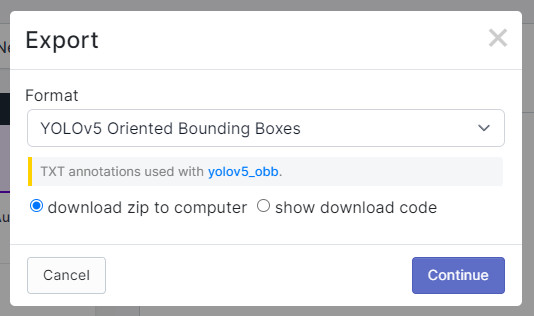

# Getting Started

## Installation Instructions

**These instructions were tested on Ubuntu LTS 20.04**

**1. Install torch vision**

- pip install torch==1.10.1+cu113 torchvision==0.11.2+cu113 torchaudio==0.10.1+cu113 -f https://download.pytorch.org/whl/cu113/torch_stable.html

**2. Clone this repository & move into the yolov5_obb directory**

- git clone https://github.com/Zenny00/REU-Oyster_Orientation.git
- cd yolov5_obb

**3. Install requirements**

- pip install -r requirements.txt
- cd utils/nms_rotated

If the first command does not work use the second command:
- python setup.py develop  
or 
- "pip install -v -e ."

# Train a model

**1. Compile Dataset**

Collect images and annoatate them using Roboflow.
Export the images into the YOLOv5 Oriented Bounding Boxes format.



At the time of writing this document, the output format has issues with negative values.
To fix this, download the dataset and unzip it into the dataset directory.
Move the RemoveNegative script from the tools directory into the labelTxt directories for each of the train, valid, and test sets.
Run the script inside each of the labelTxt directories.
Move the script back to the tools directory.

Make sure your directory structure matches the following figure
```
parent
├── yolov5
└── datasets
    └── roboflow
        ├── train_split_rate1.0_subsize1024_gap200
        ├── train_split_rate1.0_subsize1024_gap200
        └── test_split_rate1.0_subsize1024_gap200
            ├── images
                 |────1.jpg
                 |────...
                 └────10000.jpg
            ├── labelTxt
                 |────1.txt
                 |────...
                 └────10000.txt

```

The model requires that the dataset directory is name roboflow.

**2. Train the model**

python train.py --data /content/datasets/roboflow/data.yaml --epochs *your number of epochs* --batch-size *your batch size, i.e. 2, 4, 8, 16,...* --img *image size yolov5_obb models were trained on 640x640 images* --device *0, 1, 2, cpu* --cache --weights *your choice of backbone, example yolov5x.pt* --patience *patience value for early stopping, default value 100*

# Run inference on model

To run inference using your weights or the weights provided run the following command.

python detect.py --weight *path to weights* --source *path to image or video* --conf-thres *minimum confidence value i.e. 0.5* --line-thickness *thickness of the box borders* --device *0, 1, 2, cpu*

The output of model inference will be saved to runs/detect/exp
